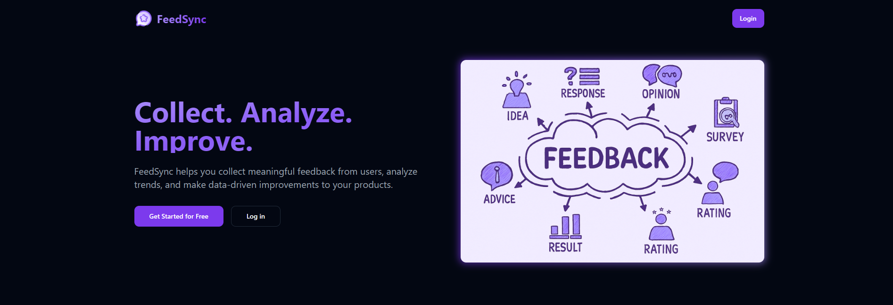

# feed-sync

Feed-sync is a lightweight feedback & campaign management application with a React frontend and a Node/Express backend. It supports user authentication, campaigns, feedback collection (with file upload support), campaign metrics..

## Preview

- [Live Site](https://feedsync.netlify.app)

## Description

Feed-sync lets teams create campaigns, collect user feedback (including file uploads), view and filter feedback, and track campaign metrics. The server includes job scripts to periodically compute/update metrics and integrates with Cloudinary for file handling.

Key functionality

- Authentication (local, JWT-based)
- Create/Edit/Delete campaigns
- Submit feedback with optional file attachment(s)
- Feedback list, pagination, filters, and votes
- Campaign metrics and a dashboard view
- File upload handling (Cloudinary)

## Tech Stack

Frontend

- React + TypeScript (Vite)
- TailwindCSS
- React Router

Backend

- Node.js + Express
- MongoDB (Mongoose)
- JWT for auth
- Multer for uploads (plus Cloudinary)
- Nodemailer for email
