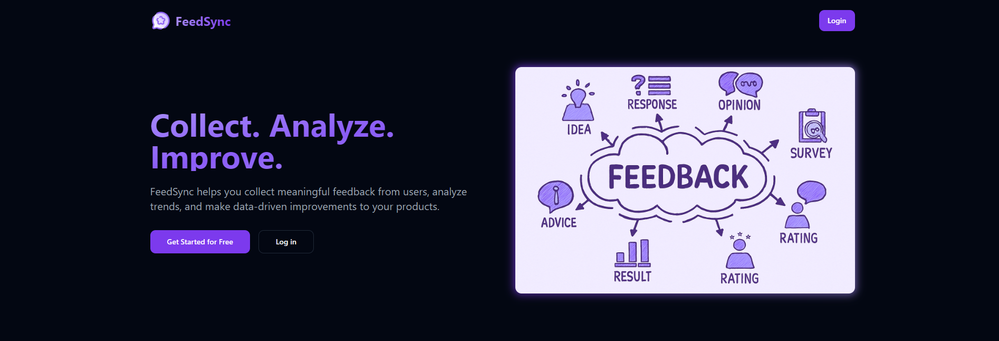

# 🚀 FeedSync

**FeedSync** is a lightweight feedback and campaign management platform built with a modern full-stack architecture using React and Node.js.

It enables teams to create campaigns, collect user feedback (with file uploads), and track performance through actionable metrics.

---

## 🔗 Live Demo

* [feedsync.rahultech.in](https://feedsync.rahultech.in)

---

## 📸 Preview

---

## 📖 Overview

FeedSync helps teams:

* Launch and manage campaigns
* Collect structured user feedback (with file attachments)
* Analyze feedback with filters, votes, and metrics
* Track campaign performance via dashboards

The backend includes background jobs for computing campaign metrics and integrates with Cloudinary for file storage.

---

## ✨ Features

* 🔐 JWT-based Authentication
* 📢 Campaign Management (Create, Edit, Delete)
* 📝 Feedback Submission with File Uploads
* 📊 Campaign Metrics & Dashboard
* 🔍 Feedback Filtering, Pagination, and Voting
* ☁️ Cloudinary Integration for File Storage

---

## 🛠 Tech Stack

### Frontend

* React + TypeScript (Vite)
* Tailwind CSS
* React Router

### Backend

* Node.js + Express
* MongoDB (Mongoose)
* JWT Authentication
* Multer (File Uploads)
* Cloudinary (Media Storage)

---

## 🌐 Deployment

The application is deployed on a VPS with:

* Docker
* Nginx
---

## 👨‍💻 Author

[**Rahul Dutta**](https://www.linkedin.com/in/irahuldutta02)

---